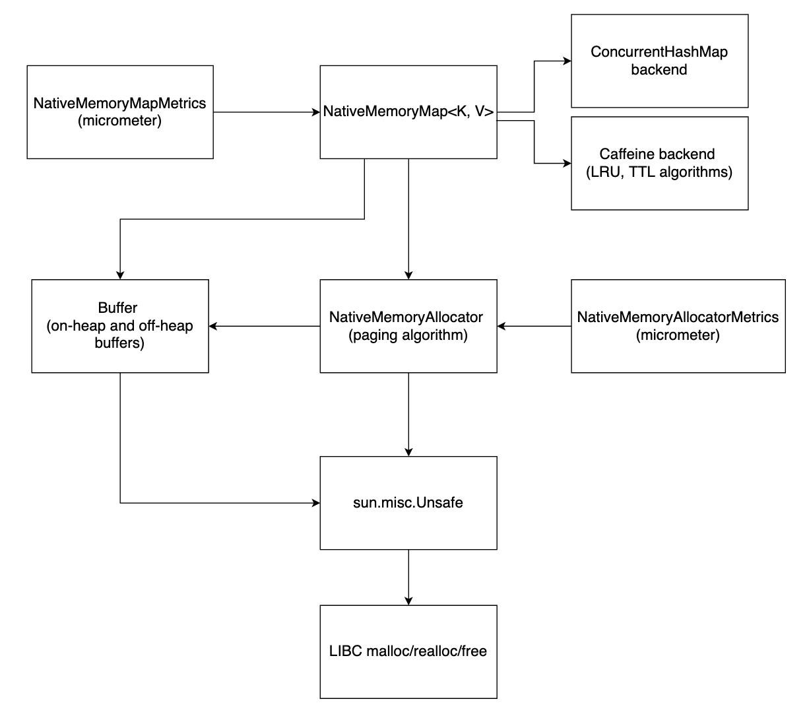

# native_memory_allocator

A library which uses sun.misc.Unsafe to allocate off-heap native memory.

## Motivation

The goal of this project is to provide a simple way to allow JVM applications to store many gigabytes of data in local
memory without garbage collection pauses and overhead.

This project provides the following components:

* NativeMemoryAllocator
    * Allocates a configurable-size block of native memory on creation
    * Breaks this block into pages of configurable size and maintains a list of free pages
    * Supports operations to allocate, resize, and free native memory buffers similar to the malloc, realloc, and free
      functions in C
    * Advantages of this design:
        * All allocate, resize, and free operations after startup are very fast because they do not do native-memory
          allocation or free operations
        * Fragmentation is not an issue because OffHeapMemoryBuffer has no requirement for memory pages to be contiguous
* Buffer
    * Supports OnHeapMemoryBuffer as a normal on-heap byte array
    * Supports NativeMemoryBuffer as a list of native memory pages allocated by NativeMemoryAllocator
    * Supports operations to copy data between OnHeap and Native buffers efficiently
* NativeMemoryMap
    * Simple, high-level Map interface supporting get and put operations
    * Manages native memory automatically as entries are added and deleted using NativeMemoryAllocator
    * Supports configurable map backends
        * java.util.concurrent.ConcurrentHashMap
        * Caffiene cache allowing use of LRU and TTL eviction algorithms https://github.com/ben-manes/caffeine
* Metrics
    * Metrics reporter classes exist for NativeMemoryAllocator and NativeMemoryMap using Micrometer

## Example Usage

See the `examples` directory for complete runnable example applications.

Basic steps to use NativeMemoryAllocator:

Define a map value object.

```
data class CacheObject(
    val s: String,
)
```

Define a `NativeMemoryMapSerializer` to convert the value object to and from byte buffers. This serializer can use any
form of serialization (e.g. Google Flatbuffers, Google Protocol Buffers, etc). The serializer will be invoked on every
get and put operation to convert between a byte buffer and a normal object.

```
private class CacheObjectSerializer : NativeMemoryMapSerializer<CacheObject> {

    override fun deserializeFromOnHeapMemoryBuffer(onHeapMemoryBuffer: OnHeapMemoryBuffer): CacheObject {
        return CacheObject(
            s = String(onHeapMemoryBuffer.toTrimmedArray()),
        )
    }

    override fun serializeToByteArray(value: CacheObject): ByteArray {
        return value.s.toByteArray()
    }

}
```

Define a NativeMemoryAllocator with a certain page size and native memory size. In this example we use a 20GB native
memory size and a 4KB page size.

The NativeMemoryAllocator will do a single allocation of all native memory when it is constructed. This is intended to
be used for the life of the application.

```
val nativeMemoryAllocator = NativeMemoryAllocatorBuilder(
    pageSizeBytes = 4_096,
    nativeMemorySizeBytes = (20L * 1_024L * 1_024L * 1_024L),
).build()
```

Define a NativeMemoryMap specifying the valueSerializer, nativeMemoryAllocator, and backend type to use.

Multiple NativeMemoryMaps may share a single NativeMemoryAllocator.

```
val nativeMemoryMap = NativeMemoryMapBuilder<Int, CacheObject>(
    valueSerializer = CacheObjectSerializer(),
    nativeMemoryAllocator = nativeMemoryAllocator,
    backend = NativeMemoryMapBackend.CONCURRENT_HASH_MAP,
).build()
```

Put a value into the map. The key will be stored as a normal object on-heap memory. The value will be serialized and
stored in off-heap memory allocated by NativeMemoryAllocator.

```
nativeMemoryMap.put(
    key = 1,
    value = CacheObject(
        s = "test",
    ),
)
```

Get a value from the map. The value will be fetched from native memory, copied into an OnHeapBuffer, deserialized, and
returned as a nullable value to indicate presence or absence in the map.

```
val value = nativeMemoryMap.get(key = 1)
```

## Class Diagram



## Generating KDoc HTML documentation

Kotlin classes in this library are documented with [KDoc](https://kotlinlang.org/docs/kotlin-doc.html) style comments.

The [Dokka](https://github.com/Kotlin/dokka) plugin is present in `build.gradle.kts`.

To generate HTML documentation use the following command:

```
./gradlew -PdokkaEnabled=true dokkaHtml
```

Open `build/dokka/html/index.html` to view generated documentation.